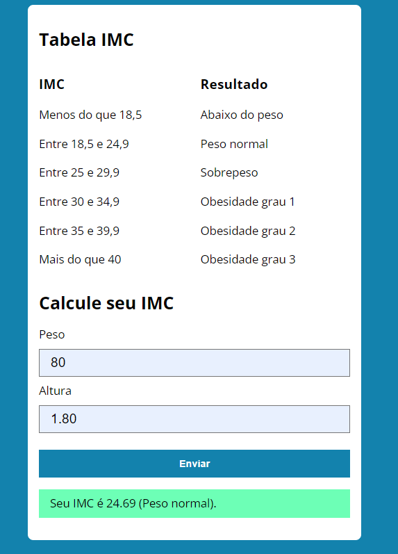
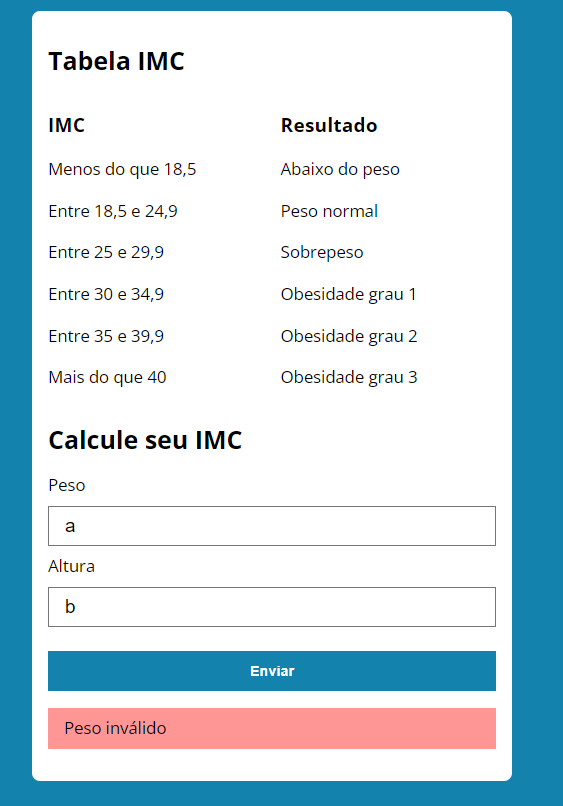

## 💻 Sobre o projeto

Uma calculadora que mede o indece da massa do corpo e depender da altura, peso a pessoa receberá uma classificação e valor imc.

---

## ⚙️ Funcionalidades

- [x] Calcular indice de massa corporal;

---

## 🎨 Layout

---

## 🛠 Tecnologias

As seguintes tecnologias foram utilizadas no desenvolvimento da calculadora no projeto:

- **[HTML](https://www.w3schools.com/html/)**
- **[CSS](https://www.w3schools.com/css/default.asp)**
- **[JavaScript](https://www.w3schools.com/js/default.asp)**

---

## 📝 Licença

Desenvolvido por [Mateus Alcantara](https://www.linkedin.com/in/mateus-alcantara-7280b525b/).

---
